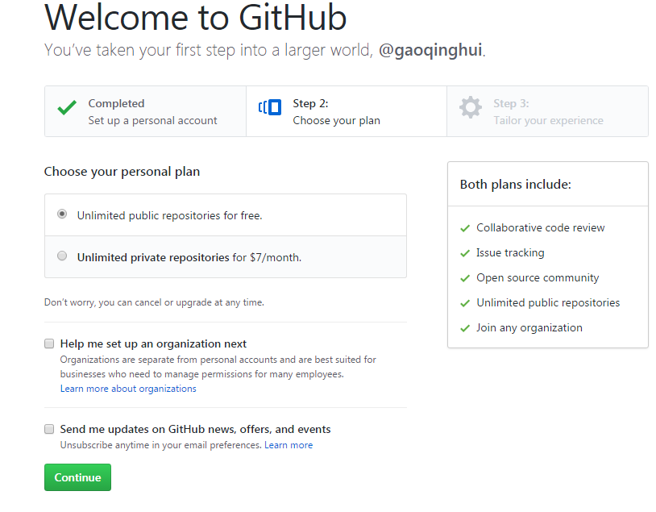
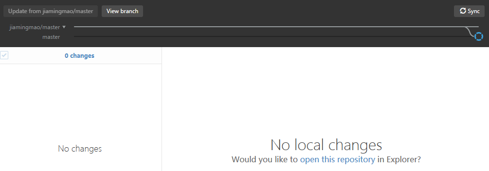

# Git Basics
#### by [Gao Qinghui](https://github.com/gaoqinghui/)
The recommendation for this course is to fork the repo, don't make any changes unless you're familar with git, and regularly synchronize the repo to update the course material.

## Introduction
Git is a free and open source distributed version control system (controlling file or project version) designed to handle everything from small to very large projects with speed and efficiency.

In this course, we will be using Git mainly for downloading and updating course materials (We will use moodle to upload homework).

## Signing up in Github

GitHub offers free accounts for user on public and open source projects, as well as paid accounts that offer unlimited private repositories and optional user management and security features.

### Signing up for service

1. Go to GitHub's homepage (https://github.com/).

2. Setting your Usernames, Email and password, then click "Sign up for GitHub"

3. Choose your personal plan with Unlimited public repositories for free.

4. Follow the prompts to create your personal account.

5. Verify your email address

## Installating and Setting up Github Desktop

Github Desktop is a tool developed by Github. To install Github Desktop, please check your operating system, then follow the instructions.

### Windows

1. Downloading GitHub Desktop

For 32-bit: https://github-windows.s3.amazonaws.com/GitHubSetup.exe

Warning: The GitHub for 32-bit operating system does not support update anymore.

For 64-bit: https://desktop.github.com/

2. In your computer's **Downloads** folder, double-click GitHub Desktop.

Before Installation, you should check if Microsoft .NET Framework 4.5 (or higher versions) has been installed in your computer.

3. In the pop-up window, click **Install**.

4. After the program has been installed, click **Run**.

5. Fill in your Username (or Email) and Password to log in.

### Mac

Your can install GitHub Desktop on OS X 10.9 or later.

1. Visit the GitHub Desktop download page.

2. Choose **Download for Mac**.

3. In your computer's **Downloads folder**, double-click the **GitHub Desktop** zip file.

4. After the file has been unzipped, double-click **GitHub Desktop**.

5. Fill in your Username (or Email) and Password to log in.

## Downloading Material

1. Copy the URL of the repository

2. Run your GitHub Desktop and clone the repository

Run your GitHub Desktop, click the **"plus sign"** botton in the upper-left-hand corner, then click "URL", paste the URL of the repositories.

https://github.com/jiamingmao/principles-of-economics.git

3. Choose the directory you wish to clone the repository into, click **clone**, and be patient.

4. Go to the directory and enjoy it.

5. Please synchronize the material regularly.

Make sure not to change anything in the directory, and click the **Sync** botton in the upper-right-hand corner. If it doesn't work, please contact me, and I will give other instructions for dealing the problem. (Since it involves some Git command, I will not show you if everything works fine).

## Other recommended Material for Git or GitHub

### GitHub help（GitHub官网出品）
https://help.github.com/

### Git 教程（通俗易懂，中文）
https://www.liaoxuefeng.com/wiki/0013739516305929606dd18361248578c67b8067c8c017b000/

### Git 基本操作（中文）
http://www.runoob.com/git/git-basic-operations.html
